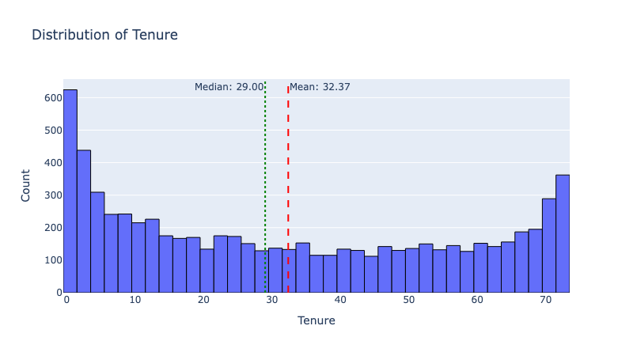

# UMBC DATA606 Capstone Project
---

## 1. Title and Author

* **Title:** A Predictive Analytics Approach to Customer Attrition in the Telecommunications Sector
* **Author:** Gowtham Krishna Sai Relangi
* Prepared for the UMBC Data Science Master's Capstone, supervised by Dr. Chaojie (Jay) Wang.
* **My GitHub Repo:** [https://github.com/Relangi-Gowtham/UMBC-DATA606-Capstone]
* **My LinkedIn Profile:** [www.linkedin.com/in/gowtham-krishna-sai-relangi-8392691b5]
* **My Presentation:** [https://github.com/Relangi-Gowtham/UMBC-DATA606-Capstone/blob/main/docs/Final_Presentation.pptx]
* **My YouTube Video:** [https://youtu.be/X56UbMIcb-0]

---

## 2. Background

### What's This All About?
Basically, I'm trying to figure out why customers cancel their services. In the telecom world, we call this **customer churn**, or attrition. The main idea is to use historical customer data—things like what services they have, their billing info, and some basic demographics—to build a model. This model will then give us a `Yes` or `No` prediction on whether a customer is at high risk of leaving.

### Why Does This Matter So Much?
Think about it: it costs a lot more to find a new customer than it does to keep an existing one happy. When a bunch of customers leave, it hurts a company's bottom line and their market standing. By using a predictive model, a company can stop being reactive and become **proactive**. They can reach out to at-risk customers with personalized offers or support before it's too late. It’s all about turning a problem into an opportunity to build stronger customer relationships.

### The Questions I'm Answering
For this project, I'm focused on a few key research questions:
* Can a machine learning model actually predict which customers will churn just by looking at their data?
* Out of all the information I have—like contract type or monthly charges—which factors are the most important for predicting churn?
* How do different machine learning methods, specifically **Random Forest**, **XGBoost**, and **Decision Trees**, stack up against each other when it comes to predicting churn?

---

## 3. Data

### Quick Facts
For this project, I'm using a popular **Telco Customer Churn dataset** that I found on Kaggle.

* **Size:** Around **977.4 KB**
* **Shape:** It has **7,043 rows** and **21 columns**.
* **What's a row?** Each row is a unique customer.

### My Data Dictionary
I put together this sheet to keep track of what each column means.

| Column Name | Data Type | What It Is | Potential Values |
| :--- | :--- | :--- | :--- |
| `customerID` | String | A unique ID for each customer. | e.g., "7590-VHVEG" |
| `gender` | String | Female or Male. | "Female", "Male" |
| `SeniorCitizen` | Integer | Is the person a senior citizen? | 0 (No), 1 (Yes) |
| `Partner` | String | Do they have a partner? | "Yes", "No" |
| `Dependents` | String | Do they have dependents? | "Yes", "No" |
| `tenure` | Integer | The number of months they've been a customer. | 0 to 72 |
| `PhoneService` | String | Do they have phone service? | "Yes", "No" |
| `MultipleLines` | String | Do they have multiple phone lines? | "Yes", "No", "No phone service" |
| `InternetService`| String | What kind of internet service do they have? | "DSL", "Fiber optic", "No" |
| `OnlineSecurity` | String | Do they have online security? | "Yes", "No", "No internet service" |
| `OnlineBackup` | String | Do they have online backup? | "Yes", "No", "No internet service" |
| `DeviceProtection`| String | Do they have device protection? | "Yes", "No", "No internet service" |
| `TechSupport` | String | Do they have tech support? | "Yes", "No", "No internet service" |
| `StreamingTV` | String | Do they have streaming TV? | "Yes", "No", "No internet service" |
| `StreamingMovies`| String | Do they have streaming movies? | "Yes", "No", "No internet service" |
| `Contract` | String | The type of contract they have. | "Month-to-month", "One year", "Two year" |
| `PaperlessBilling`| String | Do they use paperless billing? | "Yes", "No" |
| `PaymentMethod` | String | How do they pay? | "Electronic check", "Mailed check", "Bank transfer (automatic)", "Credit card (automatic)"|
| `MonthlyCharges` | Float | What they're charged each month. | 18.25 to 118.75 |
| `TotalCharges` | String | The total amount they've been charged so far. | Continuous numerical values |
| `Churn` | String | Did they leave the company last month? | "Yes", "No" |

### My Target & Features
* **My Target:** I’ve chosen **`Churn`** as the variable I want to predict. It's the most important one for my model!
* **My Features:** All the other columns, except for the `customerID`, are the features I'll use to train my model. They're what will help me make the churn prediction.

---

## 4. Exploratory Data Analysis (EDA) & Data Preprocessing

### 4.1 Data Cleaning and Initial Observations

The dataset was initially loaded into a pandas DataFrame, revealing a structure of 7,043 rows and 21 columns. A first look at the data revealed that the `customerID` column is a unique identifier and not a useful feature for prediction, so it was dropped. All other columns appeared to have no missing values, with the exception of the `TotalCharges` column, which contained 11 blank entries.

Upon further investigation, it was discovered that these blank entries corresponded to customers with a tenure of 0 months. This indicates that these are new customers who have not yet been billed. A logical approach was to replace these missing values with 0.0, as they have not yet incurred any total charges. This allowed the `TotalCharges` column to be converted to a numeric (float) data type for analysis.

### 4.2 Data Visualization and Insights

Visual analysis was performed to understand the distribution of different features and their relationship with customer churn.

#### 4.2.1 Numerical Features

The dataset contains three numerical features: `tenure`, `MonthlyCharges`, and `TotalCharges`. Histograms and box plots were used to examine their distributions.

* **Tenure**: The tenure of customers is relatively widespread, with notable peaks at the beginning (new customers) and the end (long-term customers) of the distribution. This bimodal-like distribution suggests two distinct customer groups: new, potentially more volatile customers, and loyal, long-standing ones. The mean tenure is around 32.37 months, while the median is 29 months.

    
    *Histogram showing the distribution of customer tenure in months.*

    .png)
    *Box plot of tenure, confirming a median around 29 months with no significant outliers.*

* **Monthly Charges**: The monthly charges show a left-skewed distribution, with a large number of customers clustered in the lower charge brackets (around $20-$30) and another significant group paying higher monthly fees (around $70-$110). This indicates different service tiers or packages are popular among customers.

    .png)
    *Histogram showing the distribution of monthly charges.*

    .png)
    *Box plot of monthly charges, illustrating the data is evenly spread with no outliers.*

* **Total Charges**: The total charges are heavily right-skewed, which is expected since this value accumulates over time. Longer-tenured customers naturally have higher total charges.

    .png)
    *Histogram showing the distribution of total charges.*

    .png)
    *Box plot of total charges, showing a right-skewed distribution with no outliers.*

* **Correlation Analysis**: A correlation heatmap revealed a strong positive correlation between `tenure` and `TotalCharges` (0.83), which is intuitive as longer tenure leads to higher cumulative charges. A moderate positive correlation also exists between `MonthlyCharges` and `TotalCharges` (0.65). These relationships are logical and confirm expected patterns in the data.

    .png)
    *Correlation heatmap of numerical features.*

#### 4.2.2 Categorical Features and Target Variable

The dataset contains several categorical features describing customer demographics and service subscriptions.

* **Customer Demographics**: The gender distribution is nearly equal, and the dataset includes both senior and non-senior citizens. A significant portion of customers have partners and dependents.
* **Service Subscriptions**: Most customers have phone service. Internet service is dominated by Fiber optic and DSL connections. Services like Online Security, Online Backup, Device Protection, and Tech Support show a "No" or "No internet service" response for a large number of customers, indicating potential areas for upselling.
* **Contract and Payment**: A large number of customers are on a Month-to-month contract, which is often associated with higher churn rates. Electronic check is the most popular payment method.

    .png)
    *Count plot showing the distribution of customers across different contract types.*

    .png)
    *Count plot showing the distribution of customers by payment method.*

* **Target Variable - Churn**: The `Churn` variable, our target for prediction, exhibits a class imbalance. Approximately 27% of the customers in the dataset have churned ("Yes"), while 73% have not ("No"). This imbalance is a critical factor to consider during model training, as it can bias the model towards the majority class and improves its ability to predict churn events.

    .png)
    *Count plot showing the distribution of the target variable, "Churn".*

### 4.3 Data Preparation for Modeling

To prepare the data for machine learning models, the following steps were taken:

1.  **Label Encoding**: Categorical features were converted into numerical representations. For binary features like 'gender' and 'Partner', "Yes" and "No" were mapped to 1 and 0, respectively. For features with more than two categories, like 'InternetService', each unique value was assigned a distinct integer. These encoders are saved to a file (`encoders.pkl`) for later use in deploying the model on new, unseen data.

2.  **Handling Class Imbalance**: The target variable, `Churn`, is imbalanced, with significantly more "No" instances than "Yes." To address this, the **Synthetic Minority Over-sampling Technique (SMOTE)** was applied to the training data. SMOTE works by creating synthetic examples of the minority class (in this case, "Yes"), thereby balancing the class distribution and helping the model learn the characteristics of both classes more effectively. This prevents the model from being biased towards the majority class and improves its ability to predict churn events.

3.  **Data Splitting**: The dataset was split into training and testing sets in an 80:20 ratio. The models will be trained on the training set and evaluated on the unseen test set to assess their real-world performance. The SMOTE technique was applied **only** to the training data to avoid data leakage and ensure that the test set remains a true representation of the original data distribution.

---

## 5. Model Training

### 5.1 Models Selected for Predictive Analytics
For this project, three classification models were selected to predict customer churn. These models offer a progression from simple and interpretable to complex and highly performant ensemble methods:
* **Decision Tree Classifier:** Chosen as a baseline model for its interpretability and ability to capture non-linear relationships.
* **Random Forest Classifier:** An ensemble method that builds multiple decision trees. It was selected to improve predictive accuracy and reduce overfitting compared to a single Decision Tree.
* **XGBoost (Extreme Gradient Boosting) Classifier:** A highly optimized gradient boosting algorithm known for its speed and superior performance on structured tabular datasets.

### 5.2 Training Methodology
The training process involved the following key steps:
* **Train-Test Split:** The dataset was divided into training and testing sets using an **80/20 split** (80% training, 20% testing). This ratio ensures a substantial amount of data for model learning while reserving a sufficient portion for validating performance on unseen data.
* **Handling Class Imbalance (SMOTE):** During the EDA phase, a significant class imbalance was identified, with "No Churn" instances far outnumbering "Churn" instances. To address this, the **Synthetic Minority Over-sampling Technique (SMOTE)** was applied. Crucially, SMOTE was applied **only to the training data** to prevent data leakage and ensure that the test set remained a realistic representation of the original data distribution.

### 5.3 Python Packages & Environment
The project was implemented using the following Python libraries and development environment:
* **Python Packages:**
    * `pandas` & `numpy`: For data manipulation and numerical operations.
    * `scikit-learn`: For implementing Decision Tree and Random Forest models, splitting the dataset (`train_test_split`), and calculating evaluation metrics (`accuracy_score`, `confusion_matrix`, `classification_report`).
    * `xgboost`: Specifically for the XGBoost Classifier implementation.
    * `imblearn` (imbalanced-learn): For applying the SMOTE technique to balance the training data.
    * `plotly`: For creating interactive visualizations to analyze model performance.
* **Development Environment:** The project was developed and executed in **Google Colab**, a cloud-based Jupyter notebook environment that provides pre-installed data science libraries and free access to computing resources.

### 5.4 Performance Measurement
To measure and compare the effectiveness of the models, the following metrics were used:
* **Accuracy Score:** To assess the overall correctness of the model's predictions.
* **Precision, Recall, and F1-Score:** Given the imbalanced nature of the dataset (churn is the minority class), accuracy alone can be misleading. Therefore, particular attention was paid to the **Recall** and **F1-Score** for the "Churn" class (1). High recall is essential in this context to ensure the model successfully identifies as many at-risk customers as possible.
* **Confusion Matrix:** To visualize the true positives, true negatives, false positives, and false negatives, providing a detailed breakdown of where the model is making errors.

---

## 6. Application of the Trained Models

To make the predictive model accessible to end-users, I developed a web application using **Streamlit**. This framework was selected for its simplicity and seamless integration with Python's data science stack.

**Key Features & Implementation:**
* **User Interface:** The app features a sidebar for users to input customer demographics and service details. It helps ensure data consistency by automatically calculating derived features like `TotalCharges`.
* **Real-Time Prediction:** The application loads the pre-trained **Random Forest Classifier** and label encoders using `pickle`. It preprocesses the user inputs on the fly to generate instant predictions.
* **Visual Results:** The output clearly displays the predicted outcome ("Churn" or "No Churn") along with probability scores, providing users with an immediate assessment of customer risk.

---

## 7. Conclusion

### 7.1 Project Summary & Impact
This project successfully established a predictive analytics framework for telecommunications customer churn. By training Decision Tree, Random Forest, and XGBoost models on historical data, I identified the **Random Forest Classifier** as the most effective solution. This model was deployed into a **Streamlit web application**, transforming complex analytics into a practical, real-time decision-support tool for stakeholders to proactively retain at-risk customers.

### 7.2 Limitations
* **Static Data:** The model is built on a snapshot of data and does not account for real-time market changes or recent competitor actions.
* **Feature Gaps:** The dataset lacks granular usage metrics (e.g., daily call logs, support chat transcripts) which could enhance accuracy.
* **Class Imbalance:** Despite mitigation efforts, the scarcity of "Churn" examples remains a challenge for achieving optimal recall.

### 7.3 Lessons Learned
* **Data Balancing:** Addressing class imbalance via **SMOTE** was crucial for the model to effectively detect the minority churn class, proving that accuracy alone is insufficient.
* **End-to-End Implementation:** The project highlighted that model value is realized only through deployment. Building the Streamlit app bridged the gap between technical code and business usability.

### 7.4 Future Directions
* **Unstructured Data:** Integrating text analysis from customer support logs could provide deeper insights into dissatisfaction.
* **Advanced Modeling:** Future work could explore Deep Learning (e.g., Neural Networks) to capture complex non-linear patterns.
* **Cloud Deployment:** Deploying the app to a cloud platform (e.g., AWS, Heroku) with automated retraining pipelines would ensure the model stays current.

---

## 8. References

**1. Scikit-learn Documentation**
* The core machine learning library used for data preprocessing (`LabelEncoder`), model implementation (Decision Tree, Random Forest), and performance evaluation metrics.
* *Link:* [https://scikit-learn.org/stable/](https://scikit-learn.org/stable/)

**2. Imbalanced-learn Documentation (SMOTE)**
* Critical for the project's success, this library provided the **SMOTE** technique used to address the significant class imbalance in the training data.
* *Link:* [https://imbalanced-learn.org/stable/](https://imbalanced-learn.org/stable/)

**3. Streamlit Documentation**
* The framework used to build and deploy the interactive web application, allowing end-users to utilize the trained model.
* *Link:* [https://docs.streamlit.io/](https://docs.streamlit.io/)
